# dotfiles

This is a repository containing all of my configurations of my current rice.
I use [GNU Stow](https://www.gnu.org/software/stow/) to manage my dotfiles (for a tutorial, [click here](https://alexpearce.me/2016/02/managing-dotfiles-with-stow/)).

## Requirements
* GNU Stow
* [Xfce](https://gitlab.xfce.org)
* [i3-gaps](https://github.com/Airblader/i3)
* The [Plata-Noir-Compact](https://gitlab.com/tista500/plata-theme) GTK theme
* The [Papirus-Dark](https://github.com/PapirusDevelopmentTeam/papirus-icon-theme) icon theme
    * The [papirus-folders](https://github.com/PapirusDevelopmentTeam/papirus-folders) tool
* The Breeze Light cursor theme from KDE Plasma
* [i3lock-color](https://github.com/Raymo111/i3lock-color)
    * [xss-lock](https://bitbucket.org/raymonad/xss-lock/src/master/) (optional; for locking on screen blank)
* Roboto Font
* [Alacritty](https://github.com/alacritty/alacritty)
    * [Fortune](https://github.com/shlomif/fortune-mod)
    * Cowsay
    * [Lolcat](https://github.com/busyloop/lolcat)
    * Fira Code [NerdFont](https://github.com/ryanoasis/nerd-fonts)
* [Zsh](https://www.zsh.org/)
    * [ohmyzsh](https://github.com/ohmyzsh/ohmyzsh)
    * [zsh-syntax-highlighting](https://github.com/zsh-users/zsh-syntax-highlighting)
    * [zsh-autosuggestions](https://github.com/zsh-users/zsh-autosuggestions)
    * [powerlevel10k](https://github.com/romkatv/powerlevel10k)

### Optional
* [Vim](https://github.com/vim/vim/) 8+ (probably should be required :stuck_out_tongue:)
* [IPython](https://github.com/ipython/ipython)
* [Tmux](https://github.com/tmux/tmux)
* My wallpaper script (warning: hacky code)
    * [Pillow](https://pypi.org/project/Pillow/) (PIL fork)
    * [python-xlib](https://pypi.org/project/python-xlib/)
    * [typing-extensions](https://pypi.org/project/typing-extensions/)

## Instructions
Simply use Stow on all the folders in this repository (except for the screenshots and the `vim` folder).
For my Vim setup, use Stow on the `config` folder inside the `vim` folder as follows:
```sh
cd vim
stow -t ~ config
```

### **Papirus Folders**
Run the following command to set the folder colors of the Papirus-Dark theme to match the Plata GTK theme's colorscheme:
```sh
papirus-folders -C indigo --theme Papirus-Dark
```

### **Wallpaper Script**
The script ".wallpaper.py" enables the wallpaper to be smoothly changed every few seconds.
The wallpaper changing script is adapted from [xfce-wallpaper-transition](https://github.com/c4tz/xfce-wallpaper-transition).

How to use:
1. Run `~/.wallpaper.py -h` to get the list of available commandline arguments.
2. Run the script with the necessary arguments.

### **Lockscreen Script**
How to use:
1. Run `~/.i3locker.zsh -h` to get the list of available commandline arguments.
2. Run the script with the necessary arguments.

You can also setup `xss-lock` so that this script is called whenever the screen blanks as follows:
```sh
xss-lock ~/.i3locker.zsh
```

## Screenshots (Outdated)
### **Current Desktop**
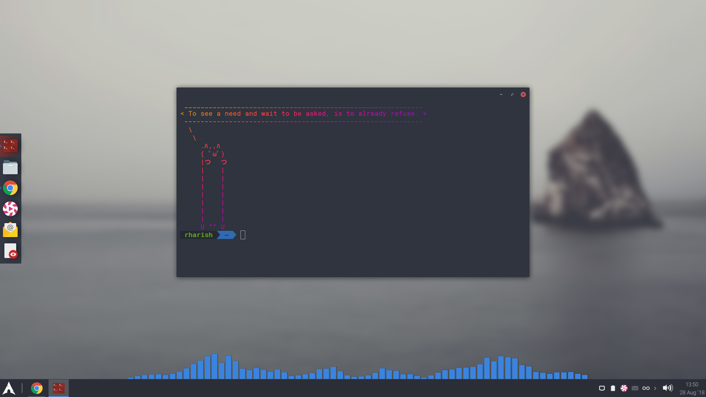

### **Individual Software**
* **XAVA**
  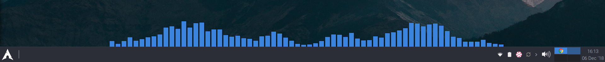

* **i3lock**
  

* **Terminator**
  * Colorscheme
    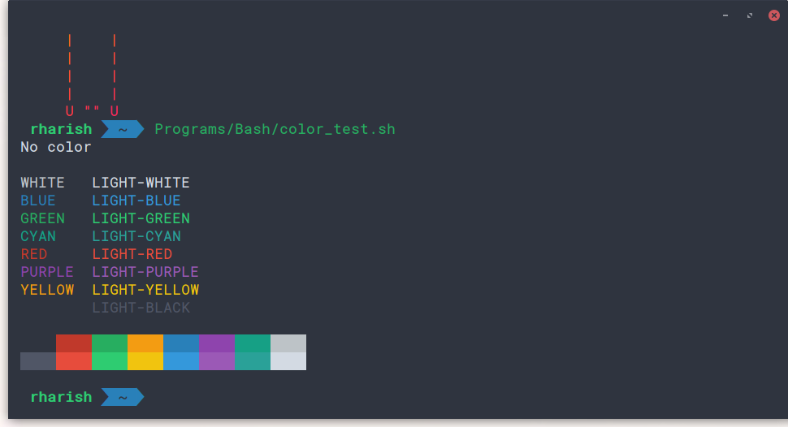

  * Cowsay (with fortune and lolcat)
    

  * Zsh
    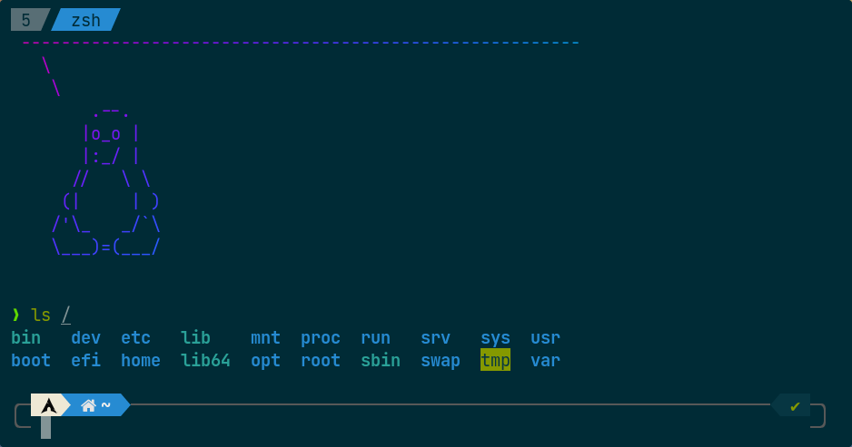
    <br>

    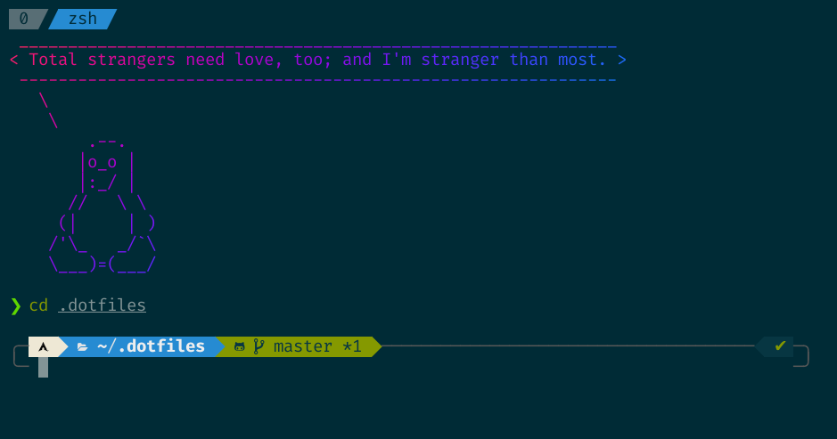

  * Bash
    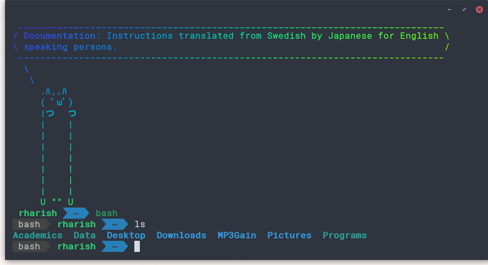
    <br>

    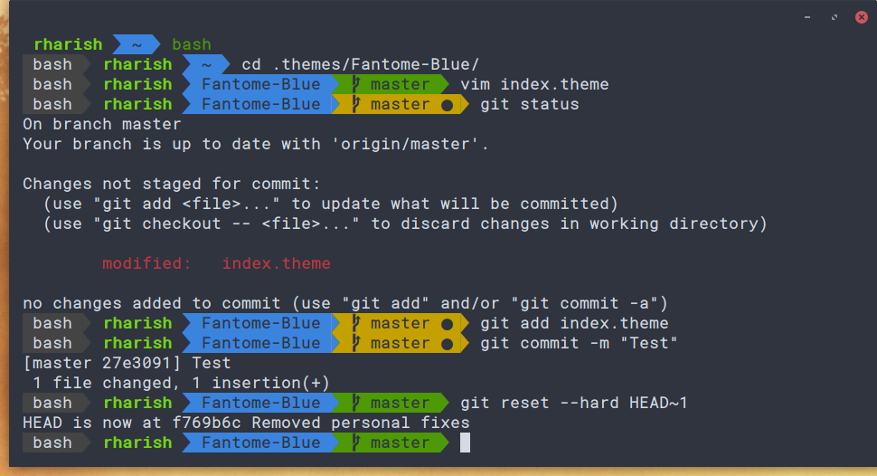

* **Wallpaper Scripts**
  

* **Vim**
  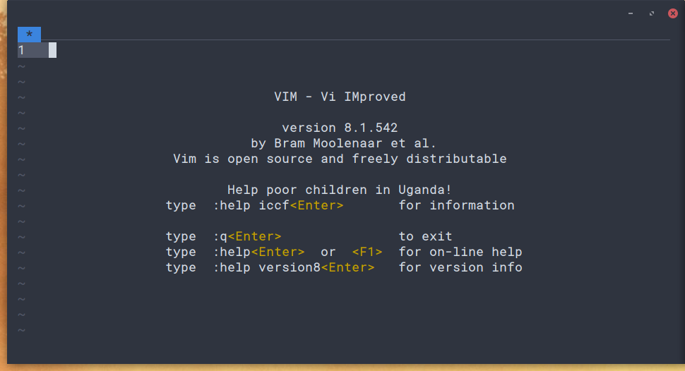
  <br>

  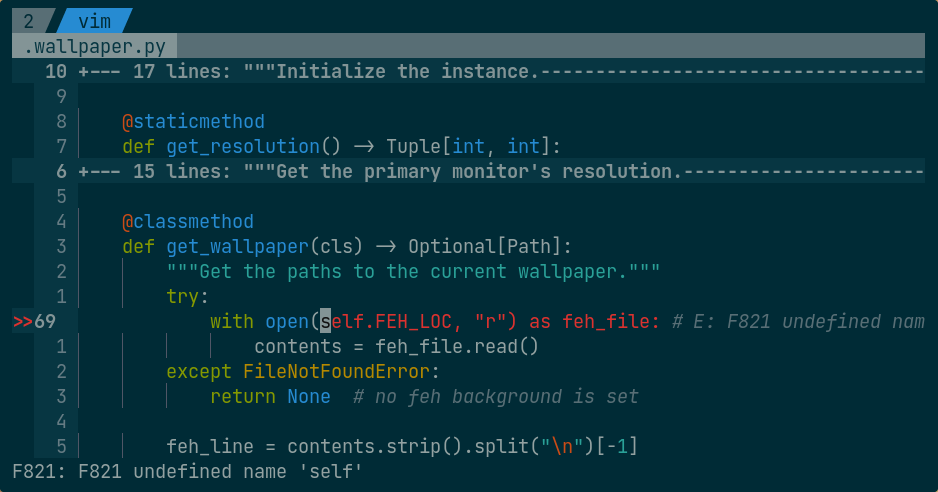
  <br>

  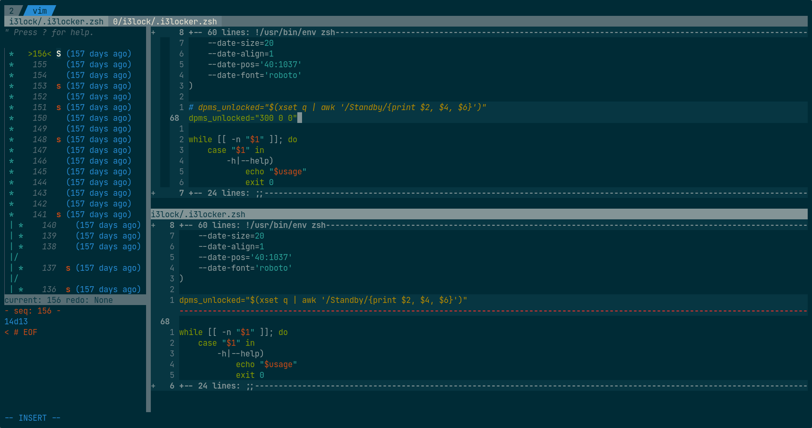

* **IPython + Powerline**
(WIP)

* **Tmux**
  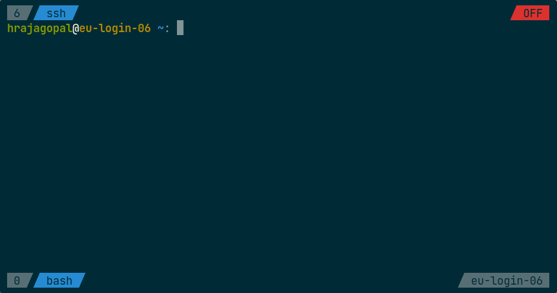

* **R**
  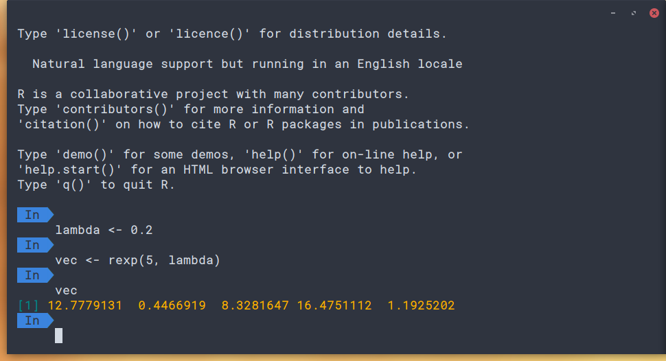
