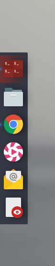
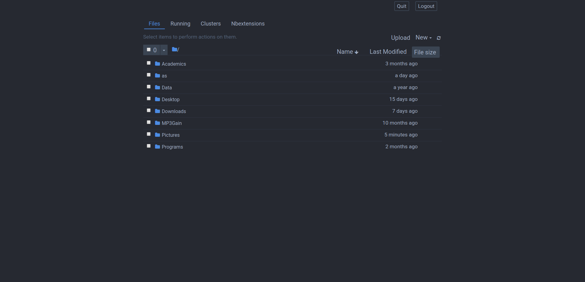
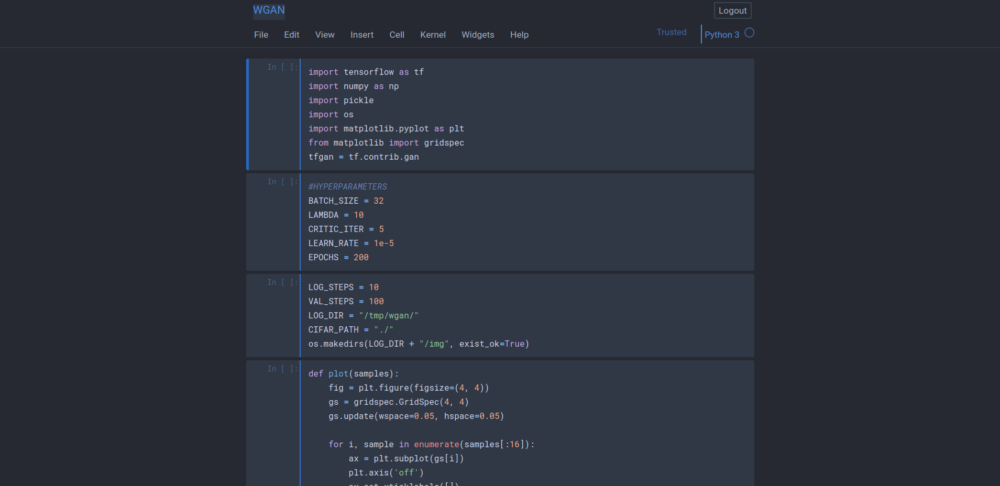

# dotfiles

This is a repository containing all of my configurations of my current rice.
I use GNU Stow to manage my dotfiles (for a tutorial, [click here]( https://alexpearce.me/2016/02/managing-dotfiles-with-stow/)).
Simply use Stow on all the folders in this repository (except for the screenshots folder).

## Requirements
* GNU Stow
* Xfce4
* Compiz
* The [Fantome-Blue](https://github.com/rharish101/Fantome-Blue) GTK theme (my custom version of [Fantome](https://github.com/addy-dclxvi/gtk-theme-collections))
* Dockbarx plugin for Xfce panel
* Cava GUI (a.k.a. [GAVA](https://github.com/nikp123/gava))
* My wallpaper scripts (WIP; hacky code as of now)
* Plank
* Roboto Font
* Terminator
  * Cowsay
  * Roboto Mono NerdFont
  * Zsh
    * oh-my-zsh

#### Optional
* Vim (probably should be required :stuck_out_tongue:)
* IPython
  * Powerline
* Jupyter Notebook
* Tmux
* R
  * The [colorout](https://github.com/jalvesaq/colorout) package

## Screenshots

### **Current Desktop**

### **Individual Software** (WIP)
* **GTK Setup**  
  Check out the [repository](https://github.com/rharish101/Fantome-Blue) for screenshots of Fantome-Blue.

* **Dockbarx (plugin for Xfce panel)**  
  

* **CAVA (requires devilspie2)**  
  

* **Wallpaper Scripts**  
    
   

  Wallpaper blurs when the active/focused window is not the desktop; and wallpaper can be smoothly changed every X seconds.  
  Wallpaper changing script adapted from [xfce-wallpaper-transition](https://github.com/c4tz/xfce-wallpaper-transition)

* **Plank**  
  

* **Terminator**
  * Cowsay (with fortune and lolcat)  
    

  * Zsh  
    
     

    

  * Bash  
    
     

    

* **Vim**
    
   

  
   

  

* **IPython + Powerline**  
(WIP)

* **Jupyter Notebook**  
    
   

  

* **Tmux**
  

* **R**
  
