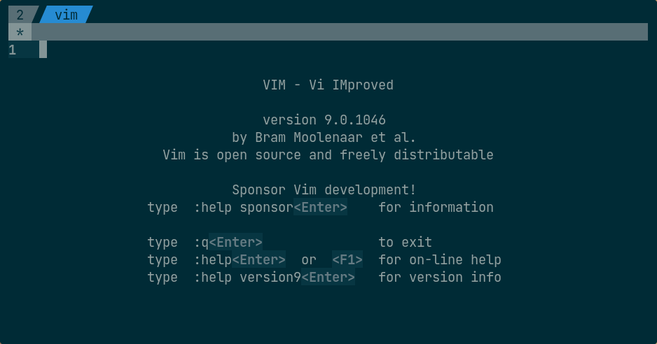

# dotfiles

This is a repository containing all of my configurations of my current rice.
I use GNU Stow to manage my dotfiles (for a tutorial, [click here]( https://alexpearce.me/2016/02/managing-dotfiles-with-stow/)).
Simply use Stow on all the folders in this repository (except for the screenshots and vim folder).

For my vim setup, use Stow on the `config` folder inside the vim folder as follows:
```
cd vim
stow -t ~ config
```

## Requirements
* GNU Stow
* Xfce4
* Compiz 0.9
* The [Fantome-Blue](https://github.com/rharish101/Fantome-Blue) GTK theme (my custom version of [Fantome](https://github.com/addy-dclxvi/gtk-theme-collections))
* Arc-X-D icon theme
  * Paper icon theme (as a fallback)
* Dockbarx plugin for Xfce panel
* Cava GUI (a.k.a. [XAVA](https://github.com/nikp123/xava))
  * devilspie2
* Plank
* i3lock-color
  * eog (optional; used in combination with Compiz as a hack for a fade-in/fade-out effect)
  * xss-lock (optional; for locking on screen blank)
* Roboto Font
* Terminator
  * Fortune
  * Cowsay
  * Lolcat
  * Roboto Mono NerdFont
* Zsh
  * oh-my-zsh

### Optional
* My wallpaper scripts (warning: hacky code)
  * Pillow (PIL fork)
  * python-xlib
* Vim (probably should be required :stuck_out_tongue:)
* IPython
  * Powerline
* Jupyter Notebook
  * jupyter_contrib_nbextensions
  * [jupyter-themes](https://github.com/dunovank/jupyter-themes)
* Tmux
* R
  * The [colorout](https://github.com/jalvesaq/colorout) package

## Instructions
* **Compiz**  
  To load the file "ccsm-settings.profile":
  1. Open Compiz Settings (CCSM)
  2. Go to Preferences > Profile & Backend
  3. Under Profile, click "Import"
  4. Select the profile "ccsm-settings.profile"

* **Wallpaper Scripts**  
  The script ".blur-desktop.py" blurs the wallpaper when the active/focused window is not the desktop.
  The script ".wallpaper.py" enables the wallpaper to be smoothly changed every X seconds.
  <br>

  The wallpaper changing script is adapted from [xfce-wallpaper-transition](https://github.com/c4tz/xfce-wallpaper-transition).
  <br>

  Both the scripts use argparse to parse commandline arguments.
  Simpy type `~/.blur-desktop.py -h` or `~/.wallpaper.py -h` to get the list of available commandline arguments.
  <br>

* **i3lock-color**  
  This uses [i3lock-multimonitor](https://github.com/ShikherVerma/i3lock-multimonitor) for multi-monitor support.
  How to use:
    * Run `~/.i3locker.sh -h` to get the list of available commandline arguments.
    * Run the script with the necessary arguments.
    * You can change the argument defaults in the script itself.
  <br>

  You can also setup xss-lock so that i3lock is called whenever the screen blanks as follows:
  ```
  xss-lock ~/.i3locker.sh
  ```

## Screenshots

### **Current Desktop**


### **Individual Software**
* **GTK Setup**  
  Check out the [repository](https://github.com/rharish101/Fantome-Blue) for screenshots of Fantome-Blue.

* **Dockbarx (plugin for Xfce panel)**  
  

* **XAVA**  
  

* **Plank**  
  

* **i3lock**  
  

* **Terminator**
  * Colorscheme  
    

  * Cowsay (with fortune and lolcat)  
    

  * Zsh  
    
    <br>

    

  * Bash  
    
    <br>

    

* **Wallpaper Scripts**  
    

* **Vim**  
  
  <br>

  
  <br>

  

* **IPython + Powerline**  
(WIP)

* **Jupyter Notebook**  
    
  <br>

  

* **Tmux**  
  

* **R**  
  
