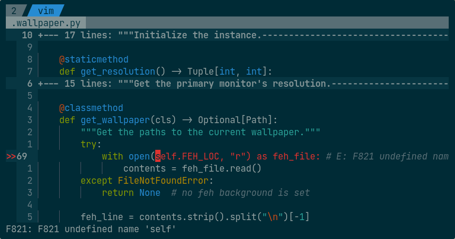
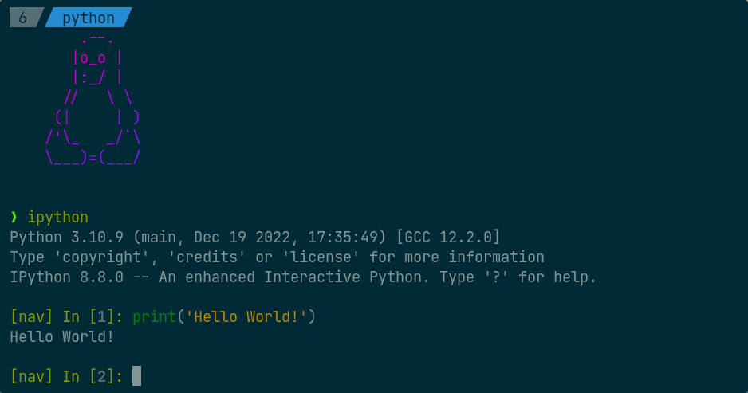

<!--
SPDX-FileCopyrightText: 2018 Harish Rajagopal <harish.rajagopals@gmail.com>

SPDX-License-Identifier: MIT
-->

# dotfiles

This is a repository containing all of my configurations of my current rice.
I use [GNU Stow](https://www.gnu.org/software/stow/) to manage my dotfiles (for a tutorial, [click here](https://alexpearce.me/2016/02/managing-dotfiles-with-stow/)).

## Requirements
* [GNU Stow](https://www.gnu.org/software/stow/) - tool used for managing dotfiles
* [Xfce](https://gitlab.xfce.org) - desktop environment
* [i3](https://github.com/i3/i3) - window manager
    * [picom](https://github.com/yshui/picom) - compositor
* [Canta-dark](https://github.com/vinceliuice/Canta-theme) - GTK theme
* [Papirus-Dark](https://github.com/PapirusDevelopmentTeam/papirus-icon-theme) - icon theme
    * [papirus-folders](https://github.com/PapirusDevelopmentTeam/papirus-folders) - tool for setting folder icon colours
* Breeze Light (from KDE Plasma) - cursor theme
* [i3lock-color](https://github.com/Raymo111/i3lock-color) - lockscreen
    * [xss-lock](https://bitbucket.org/raymonad/xss-lock/src/master/) (optional) - tool for locking on screen blank
* [Roboto](https://fonts.google.com/specimen/Roboto) - font
* [Kitty](https://sw.kovidgoyal.net/kitty/) - terminal emulator
    * [Tmux](https://github.com/tmux/tmux) - terminal multiplexer
    * [Fortune](https://github.com/shlomif/fortune-mod) - tool for random adages
    * [Cowsay](https://github.com/tnalpgge/rank-amateur-cowsay) - tool for making Tux say the random adages
    * [Dotacat](https://gitlab.scd31.com/stephen/dotacat) - tool for colouring Tux saying the random adages
    * [JetBrainsMono](https://www.jetbrains.com/lp/mono/) [Nerd Font](https://github.com/ryanoasis/nerd-fonts) - monospace font
* [Zsh](https://www.zsh.org/) - shell
    * [ohmyzsh](https://github.com/ohmyzsh/ohmyzsh) - framework for fun goodies
    * [zsh-syntax-highlighting](https://github.com/zsh-users/zsh-syntax-highlighting) - plugin for syntax highlighting
    * [zsh-autosuggestions](https://github.com/zsh-users/zsh-autosuggestions) - plugin for auto suggestions
    * [powerlevel10k](https://github.com/romkatv/powerlevel10k) - Zsh theme

### Optional
* [Vim](https://github.com/vim/vim/) 8+ (probably should be required :stuck_out_tongue:) - text editor
* [IPython](https://github.com/ipython/ipython) - interactive Python shell

## Instructions
Simply use Stow on all the folders in this repository (except for the screenshots and the `vim` folder).
For my Vim setup, use Stow on the `config` folder inside the `vim` folder as follows:
```sh
cd vim
stow -t ~ config
```

### Papirus Folders
Run the following command to set the folder colors of the Papirus-Dark theme to match the Canta GTK theme's colorscheme:
```sh
papirus-folders -C yellow --theme Papirus-Dark
```

### Lockscreen Script
How to use:
1. Run `~/.i3locker.zsh -h` to get the list of available commandline arguments.
2. Run the script with the necessary arguments.

You can also setup `xss-lock` so that this script is called whenever the screen blanks as follows:
```sh
xss-lock ~/.i3locker.zsh
```

## Screenshots
### Current Desktop


### i3lock


### Terminal
#### Colorscheme


#### Fortune + Cowsay + Dotacat


#### Zsh


#### Bash


### Vim




### IPython


### Tmux


## Licenses
This repository uses [REUSE](https://reuse.software/) to document licenses.
Each file either has a header containing copyright and license information, or has an entry in the [DEP5 file](https://www.debian.org/doc/packaging-manuals/copyright-format/1.0/) at [.reuse/dep5](./.reuse/dep5).
The license files that are used in this project can be found in the [LICENSES](./LICENSES) directory.

The MIT license is placed in [LICENSE](./LICENSE), to signify that it constitutes the majority of the codebase, and for compatibility with GitHub.
